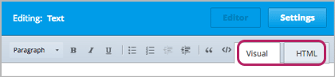

.. _Working with HTML Components:

#############################
Working with HTML Components
#############################

***********************
HTML Component Overview
***********************

You use HTML components to add and format text, links, images, and more in your course. By default, Studio has four HTML component templates. 

* :ref: `Text Template`: The most commonly used HTML component. When you select this template, a blank HTML component opens in the component editor.
* :ref: `Announcement Template`: A template that contains placeholder text and formatting that helps you create an announcement for your course.
* :ref: `Anonymous User ID Template`: 
* :ref: `Zooming Image Template`

See the following topics:

* :ref:`Create an HTML Component`
* :ref:`The User Interface`
* :ref:`Use the Announcement Template`
* :ref:`Use the Anonymous User ID Template`
* :ref:`Add a Link in an HTML Component`
* :ref:`Add an Image to an HTML Component`

.. note:: Ensure you understand the chapter :ref:`Organizing Your Course Content` before working with HTML components.

.. note:: Review :ref:`Best Practices for HTML Markup` before adding HTML components to your course.

.. _The User Interface:

*****************************************
The HTML Component User Interface
*****************************************

When you create a new HTML component, you work with the HTML component editor. The editor has two views: **Visual view** and **HTML view.** To switch between Visual view and HTML view, click the tab in the upper-right corner of the component editor.  

- **Visual view** provides a “what you see is what you get” (WYSIWYG) editor that allows you to format text by clicking the formatting buttons at the top of the editor. By default, every HTML component opens in Visual view.

  Visual view includes the following formatting buttons.

  .. image:: Images/HTML_VisualView_Toolbar.gif

  #. Select a formatting style, such as heading 1, heading 2, or paragraph.
  #. Format text in bold.
  #. Format text in italics.
  #. Underline text.
  #. Create a bulleted list.
  #. Create a numbered list.
  #. Decrease the indent.
  #. Indent text.
  #. Format text as a blockquote.
  #. Format text as code (i.e., in Courier font).
  #. Create a link.
  #. Delete the current link.

  Visual view shows your content the way it will appear in the LMS. 

  .. image:: Images/HTMLComponent_VisualView_LMS.gif

- **HTML view** allows you to edit HTML code directly.

  .. image:: Images/HTML_HTMLView.gif

  .. note:: If you're in HTML view, you can always switch to Visual view to make sure your content looks the way you expect. For example, we recommend that you do this if you add an image or a link to an HTML component.

.. _Create an HTML Component:

*****************************
Create an HTML Component
*****************************

To create an HTML component:

1. Under **Add New Component**, click **html**.

  .. image:: Images/NewComponent_HTML.gif

2. In the list that appears, click **Text**.

   An empty component appears at the bottom of the unit.
   
  .. image:: Images/HTMLComponent_Edit.gif
   
3. In the empty component, click **Edit**.
   
   The HTML component editor opens. 
  
  .. image:: Images/HTMLEditor.gif

4. Enter the text and formatting that you want, either by using the formatting buttons in Visual view or by manually adding HTML tags in HTML view. 

5. Give the HTML component a display name. The display name is the text that the student sees when he hovers his mouse over the course ribbon at the top of the page. To do this, click **Settings** in the upper-right corner of the component editor, and then enter text in the **Display Name** field. 

   To return to the text editor, click **Editor** in the upper-right corner. 

6. Click **Save** to save the HTML component.

For more information, see:

* :ref:`Add a Link in an HTML Component`
* :ref:`Add an Image to an HTML Component`

.. _Add a Link in an HTML Component:

***********************************
Add a Link in an HTML Component
***********************************

To add a link to a website, course unit, or file in an HTML component, you'll work with the **Insert/Edit Link** dialog box.

.. _Add a Link to a Website:

============================
Add a Link to a Website
============================

To add a link to a website:

#. Select the text that you want to make into the link.

#. Click the link icon in the toolbar.

#. In the **Insert/Edit Link** dialog box, enter the URL of the website that you want in the **Link URL** field.

#. If you want the link to open in a new window, click the drop-down arrow next to the **Target** field, and then select **Open Link in a New Window**. If not, you can leave the default value.
   
#. Click **Insert**.

#. Save the HTML component and test the link.

.. _Add a Link to a Course Unit:

============================
Add a Link to a Course Unit
============================

You can add a link to a course unit in an HTML component.

1. Determine the unit identifier of the unit you're linking to. To do this, open the unit page in Studio, and locate the **Unit Identifier** field under **Unit Location** in the right pane.

  .. image:: /Images/UnitIdentifier.gif

2. Copy the unit identifier.

3. Open the HTML component where you want to add the link.

4. Select the text that you want to make into the link.

5. Click the link icon in the toolbar.

6. In the **Insert/Edit Link** dialog box, enter the following in the **Link URL** field.
   
   ``/jump_to_id/<unit identifier>``

   Make sure to replace <unit identifier> (including the brackets) with the unit
   identifier that you copied in step 2, and make sure to include both forward slashes (/).

   .. image:: /Images/HTML_Insert-EditLink_CourseUnit.gif

7. If you want the link to open in a new window, click the drop-down arrow next to
   the **Target** field, and then select **Open Link in a New Window**. If not, you can leave the default value.
   
8. Click **Insert**.

9. Save the HTML component and test the link.

.. _Add a Link to a File:

============================
Add a Link to a File
============================

You can add a link in an HTML component to any file you've uploaded for the course. 

1. On the **Files & Uploads** page, copy the URL of the file.

   .. image:: Images/HTML_Link_File.gif

   For more information, see :ref:`Add Files to a Course`.

2. Select the text that you want to make into the link.

3. Click the link icon in the toolbar.

4. In the **Insert/Edit Link** dialog box, enter the following in the **Link URL** field.
   
   ``/static/FileName.type``

   Make sure to include both forward slashes (/).

   .. image:: /Images/HTML_Insert-EditLink_File.gif

5. If you want the link to open in a new window, click the drop-down arrow next to
   the **Target** field, and then select **Open Link in a New Window**. If not, you can leave the default value.
   
6. Click **Insert**.

7. Save the HTML component and test the link.

.. _Add an Image to an HTML Component:

***********************************
Add an Image to an HTML Component
***********************************

You can add an any image that you have uploaded for the course to an HTML component. 

Find any copy the URL of the image in the **Files & Uploads** page.

See :ref:`Add Files to a Course` for more information.

.. note::  Review :ref:`Best Practices for Describing Images` when adding images to HTML components.

While editing the HTML component:

#. Switch to the HTML view.

#. To add the image to a document, enter the following syntax, where URL OF FILE is the URL that you copied from the **Files & Uploads** Page. 
   
   ``

``

